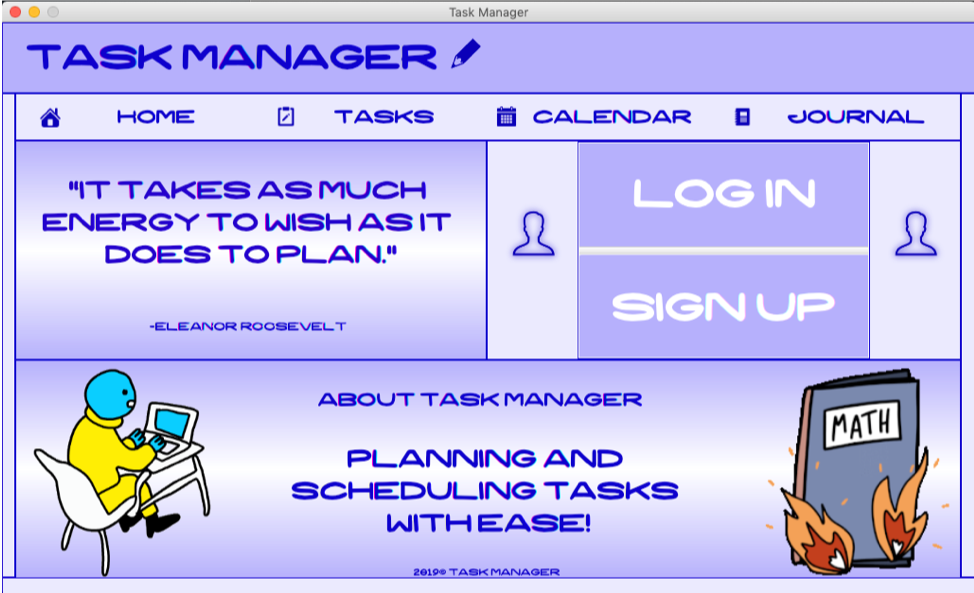
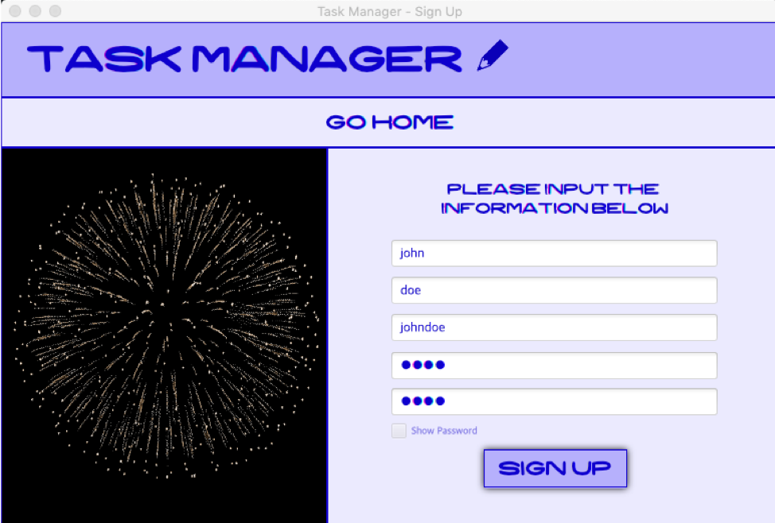
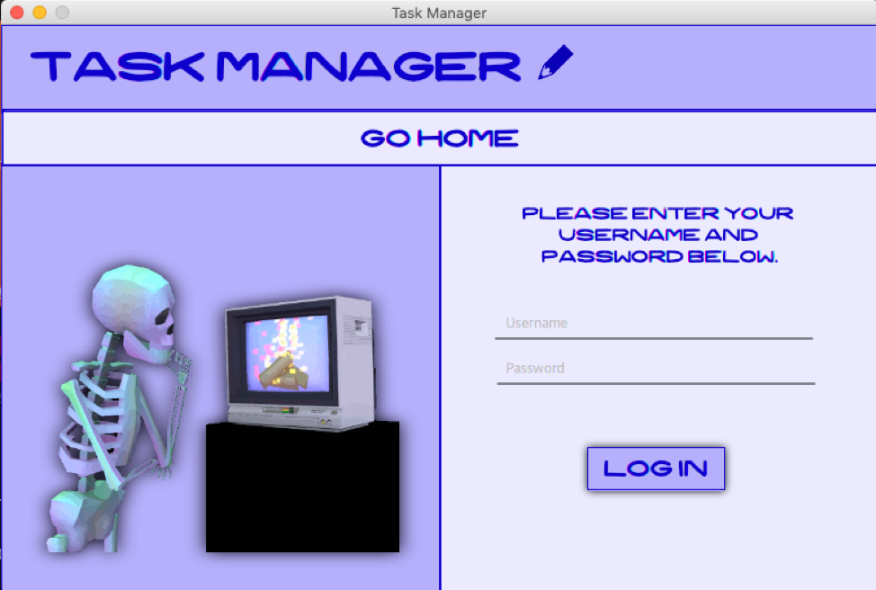
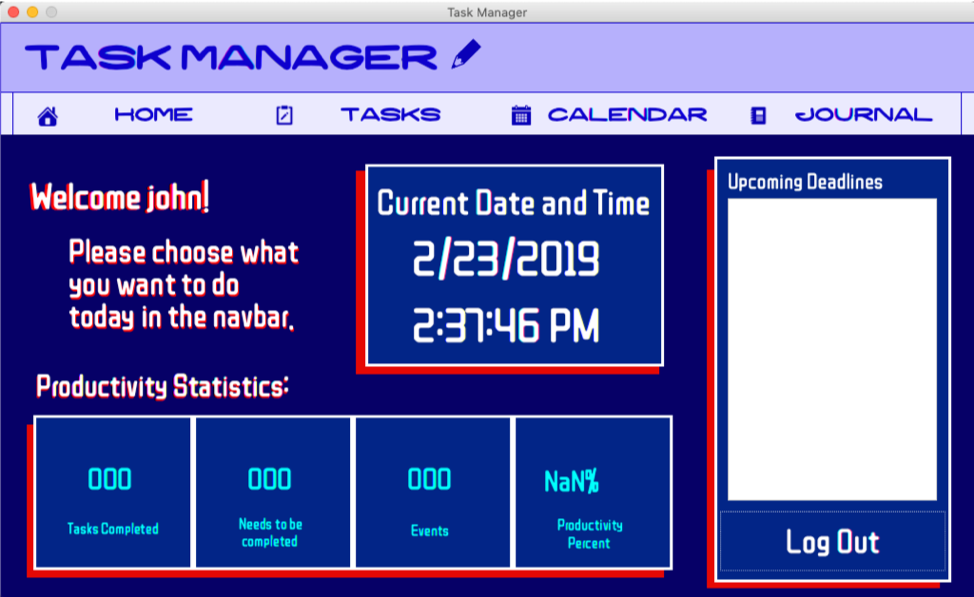
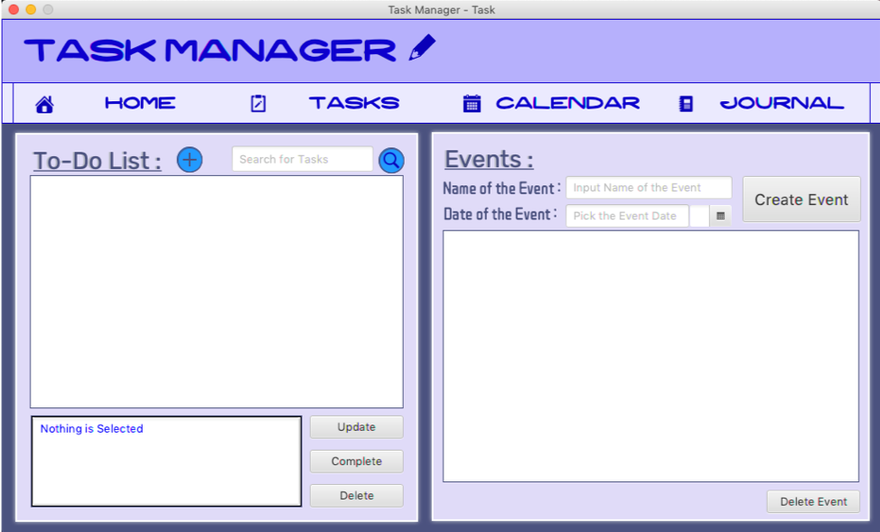
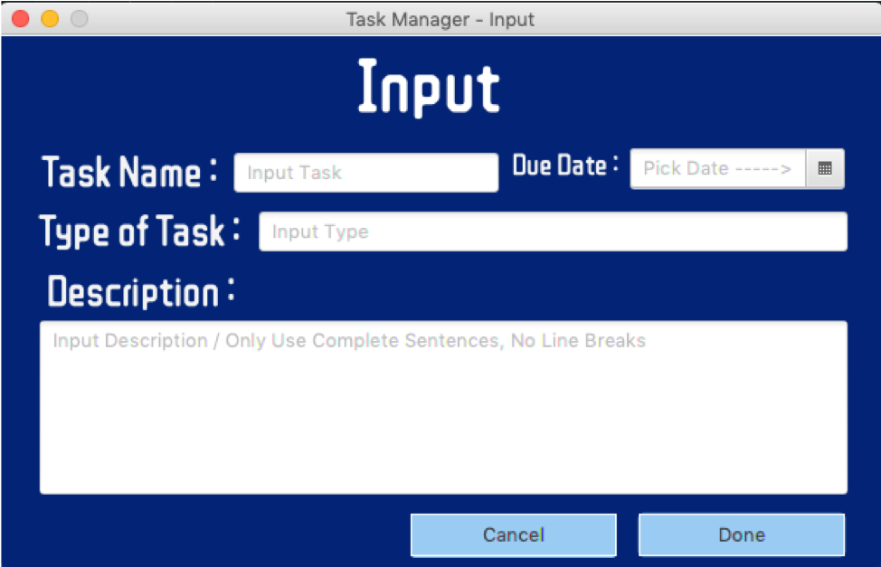
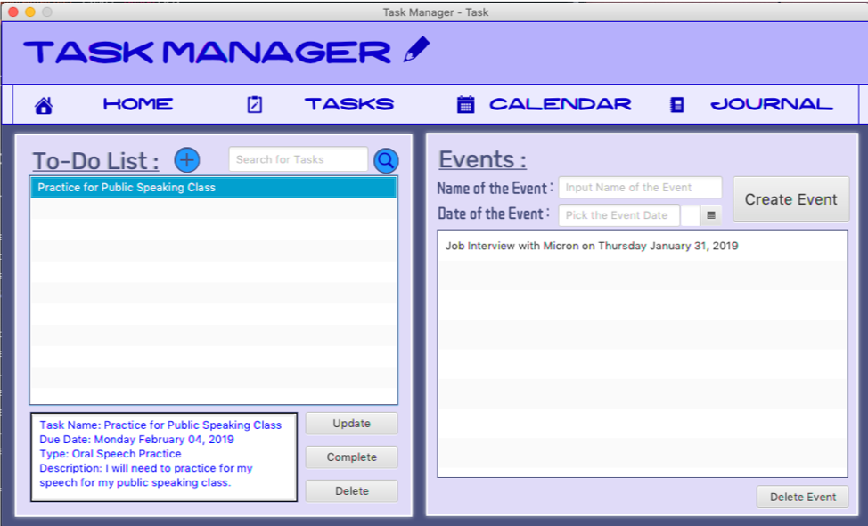
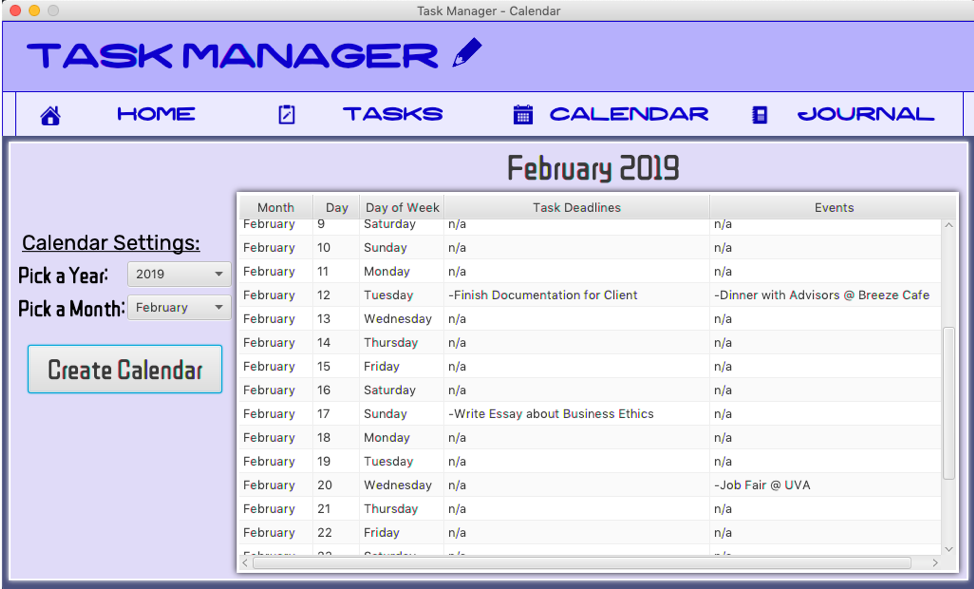
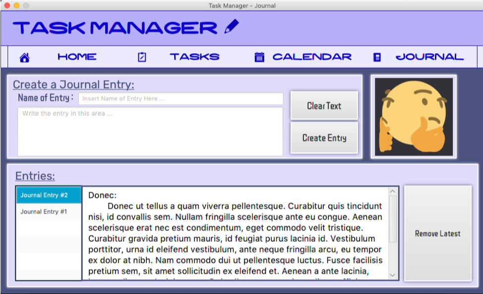

# Task Manager

> A software application to organize tasks and events that are editable and unique for each user with a calendar implementation. It also has a journal feature where users can log their day.

#### Technologies: 

- Java
- JavaFX
- CSS

---

## Table of Contents

- [How to Use](#how-to-use)
- [Implementation](#implementation)
- [Screenshots](#screenshots)
- [Author Info](#author-info)

---

## How to Use

Import the project into an IDE of your choice. Run and build the project with the ModernProject.java file. A graphical user interface of the application should appear. Before using its features, the user should sign in or log in. The interface is user-friendly, so it would not be hard to understand how to create tasks, events, or journal logs. 

---

## Implementation

> Data Structures and Algorithms:
- Doubly Linked List
- ADT Stack Implementation
- Arrays and Loops
- Graphical User Interface
- Binary Search Algorithm
- File Input / Output

The GUI was created through the use of Java SceneBuilder with JavaFX. Used CSS stylesheets to create design and styling for the panels that make up the GUI of the application.

---

## Screenshots

> Screenshots of the application while it is running.

---

## Author Info

- LinkedIn - [Charles Ezra Cabauatan](https://www.linkedin.com/in/charlesezra/)
- Website - [charlesezra.github.io](https://charlesezra.github.io)
- Twitter - [@yupocharlie](https://twitter.com/yupocharlie)

[Back To The Top](#Task-Manager)

---
